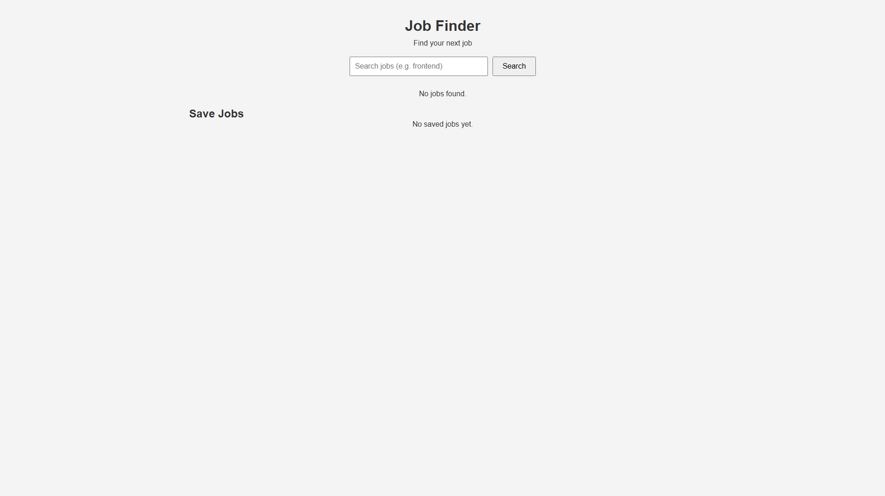

# Job Finder App

A job search web app built with HTML, CSS, and JavaScript using a public jobs API.

## Features

- Search jobs by keyword
- View job title, company, and location
- Open job application links
- Save jobs with LocalStorage
- Remove saved jobs
- Press Enter to search
- Disabled save button for saved jobs

## Built With

- HTML
- CSS
- JavaScript
- Jobs API

## Screenshot

## Live Demo

https://kkato0219.github.io/job-finder-app/

## What I Learned

This project helped me practice:
- Fetching data from an API
- Displaying dynamic job cards
- Using LocalStorage
- Handling button events
- Updating the UI after saving jobs